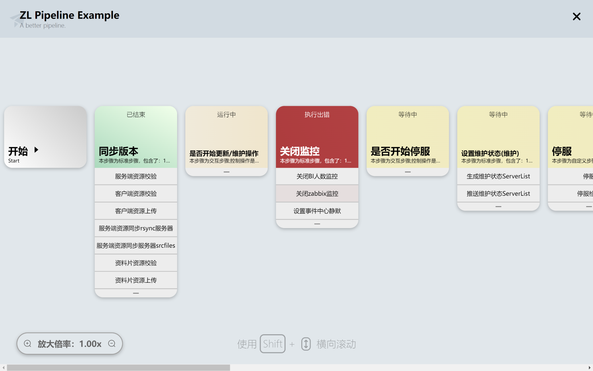
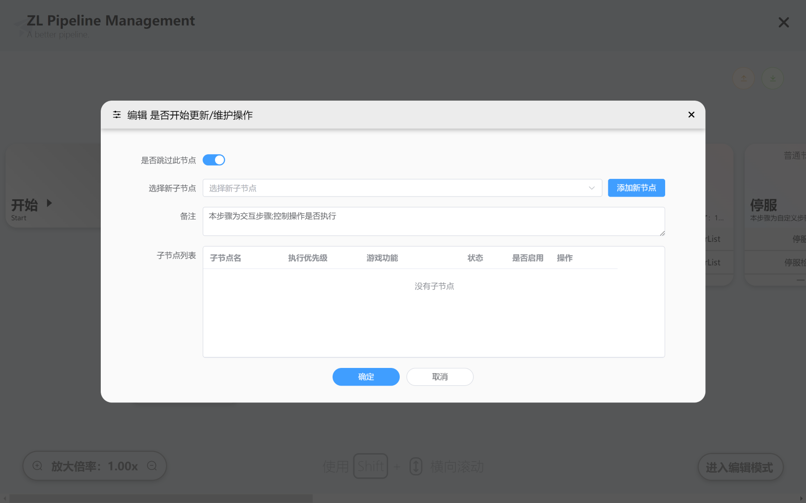

<div align="center">

# ZL-Pipeline

#### A single-line Pipeline component package (Under Development)


</div>

## Introduction

> Language: [ENGLISH] | [[中文]](./README-CN.md)

> ZL-Pipeline supports English (enUS) and 简体中文（zhCN）

**ZL-Pipeline** is a modern pipeline front-end UI with edit function inspired by **Jenkins Blue Ocean** built with **Element Plus** on **Vue 3** + **TypeScript**.

Compared with **Jenkins Blue Ocean**, **ZL-Pipeline** is more light-weighted, modernized and flexible.

ZL-Pipeline ***is still under-development now***, please test carefully before production deployment.

## Preview



*Pipeline View*



*Node Edit View*

## Install

### Quick Install

Use any package manager to install, for example, use **NPM**:

```shell
npm i zl-pipeline
```

### Dependencies

All needed dependencies are listed below, these packages will be automatically installed with `zl-pipeline`:

```json
"dependencies": {
    "file-saver": "^2.0.5"
}
```

If you want to develop ZL-Pipeline locally, you need to install these devDependencies:

```json
"devDependencies": {
    "@element-plus/icons-vue": "^2.3.1",
    "@tsconfig/node20": "^20.1.4",
    "@types/file-saver": "^2.0.7",
    "@types/node": "^20.14.5",
    "@vitejs/plugin-vue": "^5.1.4",
    "@vue/tsconfig": "^0.5.1",
    "element-plus": "^2.8.1",
    "less": "^4.2.0",
    "npm-run-all2": "^6.2.0",
    "typescript": "~5.4.0",
    "unplugin-auto-import": "^0.18.3",
    "unplugin-icons": "^0.19.3",
    "unplugin-vue-components": "^0.27.4",
    "vite": "^5.3.1",
    "vite-plugin-dts": "^4.2.2",
    "vue": "^3.4.29",
    "vue-router": "^4.3.3",
    "vue-tsc": "^2.0.21"
}
```

## Usage

### Import

You can import `ZL-Pipeline` default fonts by import globally using following CSS.

> For Apple users, ZL-Pipeline will use `-apple-system` font by default

```html
// Google Fonts
<link href="https://fonts.googleapis.com/css?family=Noto+Sans+SC:wght@400;700&display=swap" rel="stylesheet">

// Mirror
<link href="https://fonts.loli.net/css?family=Noto+Sans+SC:wght@400;700&display=swap" rel="stylesheet">
```

Only `ZL-Pipeline` module is necessary, `ElementPlus` does not need to be imported:

```typescript
// main.ts
import './assets/main.css'

import { createApp } from 'vue'
// Import ZL-Pipeline CSS
import 'zl-pipeline/dist/style.css'
import App from './App.vue'

const app = createApp(App)

app.mount('#app')
```

`ZL-Pipeline` supports Tree-Shaking, its eazy to import single component:

```html
<script setup lang="ts">
    /* Import in script */
    import { ZLPipeline, ZLPipelineManage } from 'zl-pipeline'
</script>
<template>
    /* Use in template, some variables are hidden */
    
    <ZLPipeline 
    :pipelineVisible="pipelineVis" 
    :bShowEditModeButton="true" 
    :bAllowEditPopover="false"
    :graphData="pipelineData" 
    :pipelineMeta="pipelineMeta"
    lang="enUS"
    @onClose="closePipeline" 
    @onClickOpenNode="openNodePop"
    @onClickOpenStatus="openStatusPop"
    />

    <ZLPipelineManage 
    :pipelineVisible="manageVis" 
    :pipelineMeta="pipelineMeta" 
    :graphData="pipelineManageData"
    lang="enUS"
    @onClose="closeManage" 
    @onClickOpenNode="openNodePop"
    />

    <ZLPipelineNodePop 
    :popMeta="nodeMeta" 
    :popVisible="popNodeVis" 
    :gameTypeOptions="gameTypes"
    :gameChildNodesOptions="gameChild" 
    lang="enUS"
    @onClose="closeNodePop" 
    />
    
    <ZLPipelineStatusPop 
    :popMeta="popMeta" 
    :popStatusList="popStatusList" 
    :popVisible="popVis" 
    @onClose="closeStatusPop" 
    />
</template>
```

### Available Input Data & Callbacks

There are 4 types of components available in ZL-Pipeline:

* ZLPipeline : Main pipeline with adjustable edit nodes / view nodes function.
* ZLPipelineManage : Manage pipeline with no live status shown but can edit pipeline nodes.
* ZLPipeline-StatusPop : Show pipeline node status.
* ZLPipeline-NodePop : Modify pipeline childnodes.

All of them will receive some certain typed data:

#### Input:

* **:pipelineVisible** :
  * Type: `Boolean`
  * Desc: Control pipeline display
  * Available: ZLPipeline / ZLPipelineManage
* **:popVisible** :
  * Type: `Boolean`
  * Desc: Control popover display
  * Available: ZLPipeline-StatusPop / ZLPipelineManage-NodePop
* **:popMeta** :
  * Type: `Object<popMetaStatus>`
  * Desc: Popover metadata for StatusPop (e.g. Title)
  * Available: ZLPipeline-StatusPop
* **:popMeta** :
  * Type: `inputGraphData`
  * Desc: Popover metadata for NodePop (e.g. Title)
  * Available: ZLPipeline-NodePop
* **:popStatusList** :
  * Type: `Object<popStatusList>`
  * Desc: Popover status data for StatusPop
  * Available: ZLPipeline-StatusPop
* **:bShowEditModeButton** :
  * Type: `Boolean`
  * Desc: Control show pipeline edit mode button
  * Available: ZLPipeline
* **:bAllowEditPopover** :
  * Type: `Boolean`
  * Desc: Control show pipeline edit popover
  * Available: ZLPipeline
* **:graphData** :
  * Type: `Array<inputGraphData>`
  * Desc: Pipeline full data
  * Available: ZLPipeline / ZLPipelineManage
* **:pipelineMeta** :
  * Type: `inputPipelineMetaData`
  * Desc: Pipeline metadata (e.g. Title)
  * Available: ZLPipeline / ZLPipelineManage
* **:gameChildNodesOptions** :
  * Type: `Array<inputChildNodeObj>`
  * Desc: Edit node popover's child nodes list
  * Available: ZLPipeline-NodePop
* **:gameTypeOptions** :
  * Type: `Array<string>`
  * Desc: Edit node popover's child nodes game types list
  * Available: ZLPipeline-NodePop
* **lang** :
  * Type: `String`
  * Desc: Language selection (Now support zhCN and enUS)
  * Available: All Except ZLPipeline-NodePop

#### Output (Callback):

* **@onClose** :
  * Type: `Callback`
  * Desc: Emit when user click close button
  * Available: All Components
* **@onChange** :
  * Type: `Callback`
  * Desc: Emit when user change any data (need further development)
  * Available: All Components
* **@onSubmit** :
  * Type: `Callback`
  * Desc: Emit when user click any submit button (need further development)
  * Available: All Components
* **@onClickOpenNode** :
  * Type: `Callback`
  * Desc: Emit when user click any node
  * Available: ZLPipeline / ZLPipelineManage
* **@onClickOpenStatus** :
  * Type: `Callback`
  * Desc: Emit when user click any node status
  * Available: ZLPipeline

### Data Structure

#### inputGraphData

`inputGraphData` is a special data structure defined in ZLPipeline to show Pipeline view:

```typescript
[
    {
        name: string
        description: string
        status: string
        is_enable: boolean
        child: {
            name: string
            description: string
            status: string
            is_enable: boolean
            order: number
            game_type: Array<string>
        }
        result: {
            title: string
            text: string
        }
    },
    {
        // Other Nodes
    }
]
```

`popMetaStatus` is a special data structure defined in ZLPipeline-StatusPop metadata:

```typescript
{
    title: string
}
```

`popStatusList` is a special data structure defined in ZLPipeline-StatusPop to show results:

```typescript
[
    {
        title: string,
        text: string
    },
    {
        // Other Status
    }
]
```

`inputChildNodeObj` is a special data structure defined in ZLPipeline-StatusPop to define available child node list:

```typescript
{
    label: string,
    value: string
}
```

> Author: Tyuwwe
>
> Date: 2024/10/8
